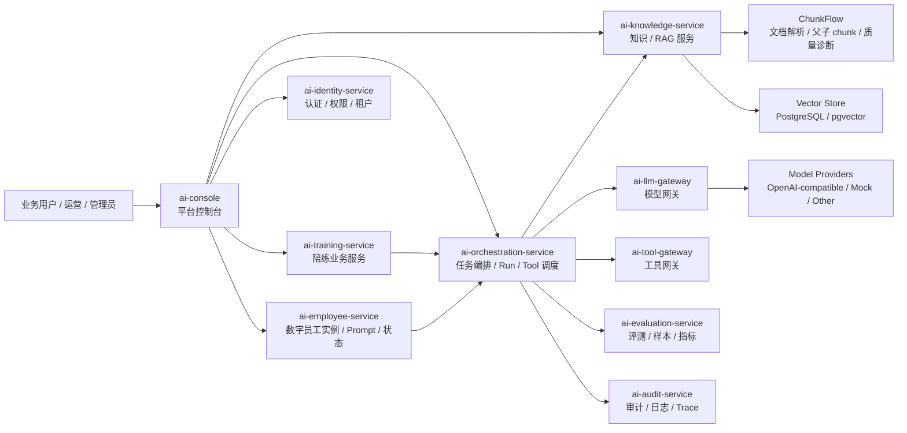

# AI 平台服务边界图

## 一句话说明

这个架构强调的不是“把所有 AI 能力堆在一个服务里”，而是把知识、模型、数字员工、编排、评测、审计和身份边界拆开，使业务服务可以通过稳定接口接入 AI 能力。

## 服务边界

## 设计取舍

| 设计点 | 选择 | 原因 |
| --- | --- | --- |
| 业务服务不直连模型 | 通过 LLM Gateway | 统一参数白名单、超时、fallback、request_id 和成本记录 |
| RAG 独立成知识服务 | 通过 Knowledge Service | 把 ingest、chunk、retrieval、citation、query log 和权限过滤收敛到一个边界 |
| 数字员工不等于 prompt | 独立 employee / orchestration 模型 | 需要管理 type、instance、prompt version、run、turn、state、event、trace |
| 评测不塞进业务链路 | 独立 evaluation 边界 | 便于离线样本、回归测试和上线前质量门禁 |
| 审计与 trace 独立沉淀 | 独立 audit 边界 | 面向企业交付，需要排查、追责、复盘和合规留痕 |

## 设计说明

把 AI 平台拆成“能力接入层、业务编排层、知识服务层、模型网关层、可观测与治理层”。这样做的目的不是过度微服务化，而是让每个风险点有明确归属：模型调用风险归网关，知识可信风险归 RAG 服务，数字员工状态风险归运行时，质量风险归评测服务，线上排查归审计与 trace。
