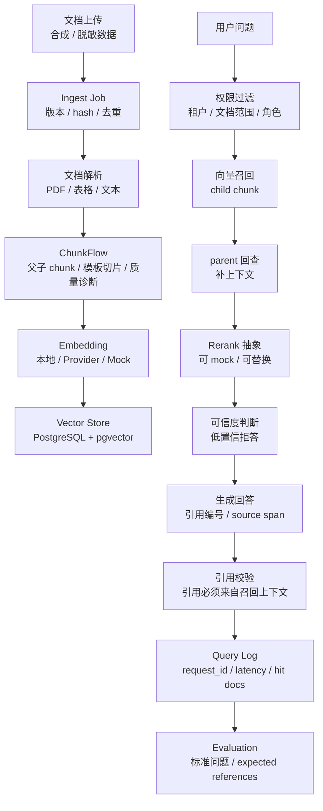

# RAG 工程证据链

## 一句话说明

可信 RAG 不是“向量库 + prompt”，而是一条从文档接入到回答生成、引用校验、拒答、日志和评测的工程链路。

## 链路图

## 关键证据

| 环节 | 需要证明什么 | 对应作品 |
| --- | --- | --- |
| 文档解析 | 能处理 PDF、表格、文本和解析降级 | [ChunkFlow](https://github.com/hui-wang-lab/ChunkFlow) |
| 切片策略 | 理解 parent-child、heading path、token 边界和质量诊断 | [ChunkFlow](https://github.com/hui-wang-lab/ChunkFlow) |
| 知识服务 | 有 ingest、retrieval、citation、权限和评测边界 | [RecallForge](https://github.com/hui-wang-lab/RecallForge) |
| 平台集成 | RAG 不是孤岛，能接入业务编排和数字员工 | [ai-platform](https://github.com/hui-wang-lab/ai-platform) |
| 业务经验 | 有智能客服问答优化经验，可迁移到 RAG query log 和评测 | [智能客服问答优化 Case Study](../case-studies/customer-service-qa-optimization.md) |

## 高频追问准备

| 面试追问 | 回答要点 |
| --- | --- |
| 为什么不用简单 fixed-size chunk？ | 企业文档结构强，标题、条款、表格和上下文边界会直接影响召回和引用质量 |
| 怎么判断回答可信？ | 看召回上下文、置信阈值、引用覆盖、引用校验、拒答策略和离线评测集 |
| 权限怎么做？ | 检索前做可见文档过滤，召回后仍保留 source metadata，生成引用时校验来源 |
| 怎么评测？ | 标准问题、expected references、拒答样本、误召回样本、query log 归因 |
| 从 Demo 到生产差什么？ | 权限、审计、评测门禁、容量评估、降级策略、监控告警、数据治理 |

