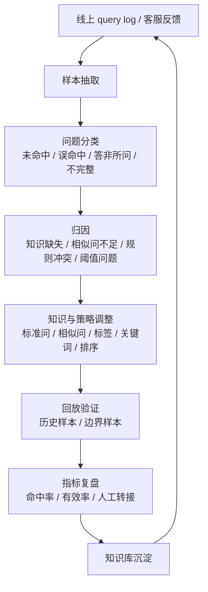

# 智能客服问答优化 Case Study

## 一句话说明

这是一个脱敏的智能客服问答链路优化复盘：从线上问题样本出发，做问题归因、知识维护、召回策略优化、反馈闭环，并迁移到 RAG 评测和 query log 思路。

## 背景

业务场景是面向用户的智能客服问答。系统需要根据用户问题命中 FAQ、标准问、相似问或规则策略，返回稳定、准确、可维护的答案。

公开边界：

- 业务名称、客户名称、真实语料和接口地址均已脱敏。
- 示例只保留问题类型、优化方法和工程复盘。
- 不包含公司私有代码和客户数据。

## 问题分类

| 问题类型 | 表现 | 可能原因 |
| --- | --- | --- |
| 未命中 | 用户问了已有知识，但系统没有返回答案 | 标准问缺失、相似问不足、召回词不覆盖 |
| 误命中 | 返回了不相关答案 | 关键词过宽、规则优先级不合理、相似度阈值偏低 |
| 答非所问 | 命中知识点相近，但没有解决用户真实意图 | 问题分类粗、业务标签缺失、答案粒度不合适 |
| 答案不完整 | 返回答案片段正确，但缺少限制条件或后续步骤 | 知识维护不完整、上下文没有结构化 |
| 反馈不可复用 | 线上问题处理完，但没有沉淀到知识库和评测集 | 缺少闭环流程和样本归因表 |

## 优化闭环

## 样本归因表示例

| 样本 | 问题类型 | 归因 | 优化动作 | 复查方式 |
| --- | --- | --- | --- | --- |
| Q001 | 未命中 | 相似问缺失 | 补充 5 条相似问，增加业务标签 | 历史 query 回放 |
| Q002 | 误命中 | 关键词规则过宽 | 缩小规则范围，增加排除词 | A/B 样本对比 |
| Q003 | 答案不完整 | 答案缺少限制条件 | 拆分答案结构，补充适用范围 | 人工验收 + 回放 |
| Q004 | 答非所问 | 意图分类粗 | 增加子意图标签，调整排序权重 | 指标复盘 |

## 与 RAG 的迁移关系

传统 FAQ 优化经验可以自然迁移到 RAG：

| FAQ 优化经验 | RAG 中的对应能力 |
| --- | --- |
| 未命中分析 | retrieval miss 分析、召回评测 |
| 误命中分析 | rerank、阈值、拒答策略 |
| 标准问 / 相似问维护 | query rewrite、query expansion、评测样本 |
| 答案完整性 | 引用覆盖、上下文拼接、答案结构约束 |
| 反馈闭环 | query log、badcase 归因、evaluation dataset |

## 面试讲述口径

这个 case 证明我不是突然转向 AI / RAG，而是之前就接触过问答系统里的知识维护、命中分析和反馈闭环。RAG 换了技术形态，但核心问题仍然是：知识怎么组织、问题怎么归因、结果怎么评测、线上 badcase 怎么持续回流。

