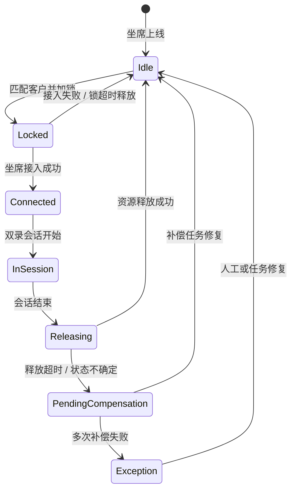
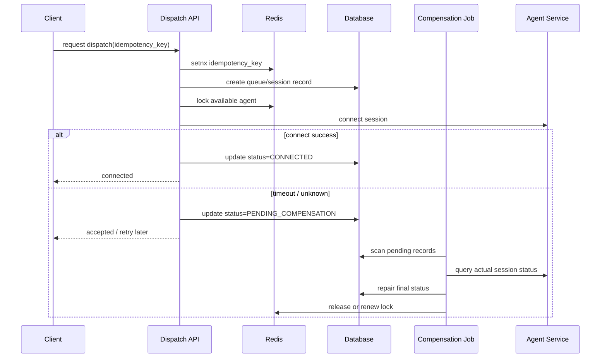

# 双录坐席调度链路优化 Case Study

## 一句话说明

这是一个脱敏的真实业务系统复盘：围绕双录坐席调度链路，处理坐席状态流转、客户排队、重复请求、网络超时、补偿任务、接口性能优化和线上排查。

## 背景

业务场景是金融业务中的双录流程。客户提交双录请求后，需要进入排队队列，由系统匹配可用坐席，坐席接入后完成会话，最后释放坐席和会话资源。

公开边界：

- 客户名称、接口地址、数据库表名、内部系统名均已泛化。
- 不包含公司私有代码、客户数据、合同或密钥。
- 性能数据经过脱敏处理，只保留量级和优化方向。

## 问题

| 问题 | 影响 |
| --- | --- |
| 坐席状态流转复杂 | 空闲、锁定、接入、通话、释放、异常状态容易出现不一致 |
| 重复请求 | 用户重试、前端重复提交、网络抖动可能导致重复排队或重复占用坐席 |
| 网络超时 | 调用外部或内部接口时，业务结果不确定，容易出现“请求失败但实际已成功” |
| 接口响应慢 | 高峰时关键接口从 1s+ 才返回，影响排队和接入体验 |
| 排查成本高 | 缺少足够的 request_id、状态变更日志和补偿链路记录 |

## 方案

关键设计：

- 使用状态机约束坐席和会话状态流转。
- 使用幂等 key 抵御重复提交和用户重试。
- 使用 Redis 做短期锁和热点数据缓存。
- 对超时和不确定状态引入补偿任务。
- 对关键 SQL 做索引和查询路径优化。
- 补 request_id、状态变更日志、审计日志和问题排查信息。

## 结果

| 指标 | 优化前 | 优化后 |
| --- | --- | --- |
| 关键接口耗时 | 1s+ | 200-300ms |
| 日常处理量 | 日均约 300 | 平稳支撑 |
| 高峰处理量 | 峰值约 3000 | 可排查、可恢复 |
| 状态异常处理 | 依赖人工排查 | 补偿任务 + 日志定位 |

## 复盘

如果重新做，我会更早补三件事：

1. 容量评估：根据坐席数、会话时长、峰值流量估算队列和锁的上限。
2. 压测基线：在上线前固定关键接口的 P95 / P99 目标。
3. 可观测闭环：把 request_id、状态机事件、补偿任务、外部调用耗时统一到 trace 视图。

## 工程价值

这个 case 体现的不是某个孤立技术点，而是复杂业务链路的后端治理能力：状态一致性、幂等、超时补偿、性能优化和线上排查。它和 AI 平台的关系也很直接，因为 AI 应用进入企业系统后，同样会遇到状态、权限、日志、降级和补偿问题。
